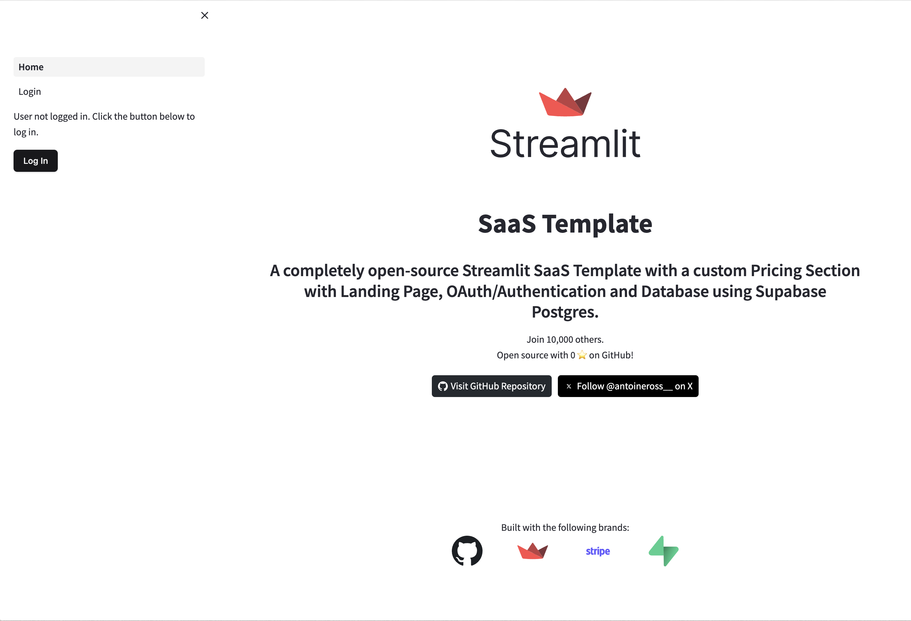
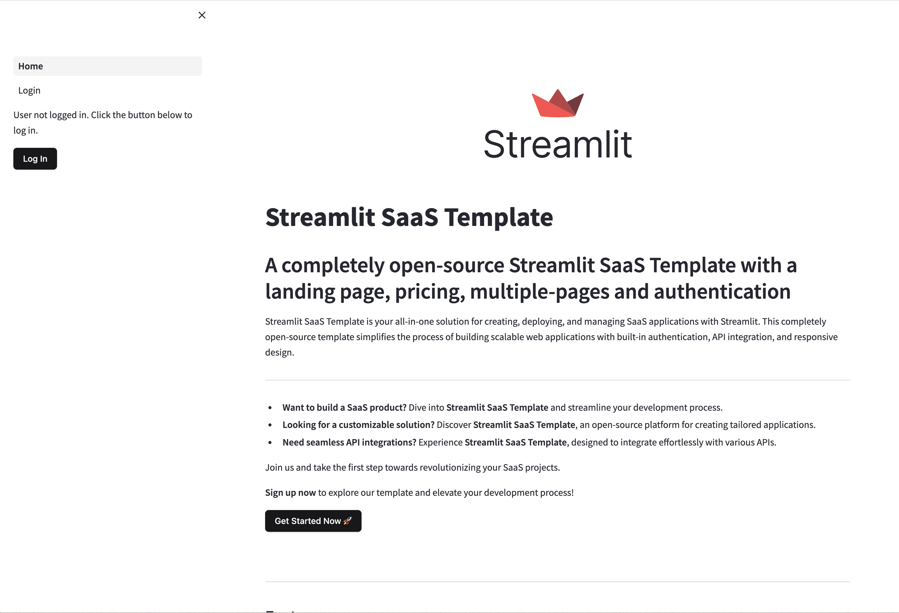

### README.md

# Streamlit SaaS Template

A completely open-source Streamlit SaaS Template with a custom Pricing Section with Landing Page, OAuth/Authentication, and Database using Supabase Postgres. See it on [Streamlit Cloud](https://saas-starter.streamlit.app/)!


## Features

### Authentication and User Experience

- **Secure OAuth Authentication**: Integrate effortlessly with Supabase for secure user authentication and session management. Supabase supports multiple providers like Google and GitHub for logging in.
- **User-Friendly Login Page**: A fully-featured landing page that includes an FAQ section, pricing table, login options, contact form, feature highlights, and a hero section.
- **Modern UI with shadcn UI**: Utilize modern and attractive UI components for forms and other interactive elements.
- **Vertical Space Function**: Customizable vertical spacing to enhance layout and design.

### Open Source and Community-Driven

- **Completely Open Source**: Join our vibrant community, report issues, suggest features, and contribute code and documentation.
- **Built with Supabase and Postgres**: Reliable backend infrastructure using Supabase with Postgres functions for efficient data management.
- **Logo Cloud**: Showcase technology stack or partners with a responsive and visually appealing logo cloud.
- **GitHub Stars**: Display the number of stars on your GitHub repository to attract more contributors.

### Comprehensive Dashboard and Hero Section

- **Dashboard with Subscription Check**: Custom Stripe payment method that checks if the user is subscribed to a plan and updates their subscription status accordingly.
- **Hero Section**: Engaging hero section with clear calls to action to captivate and convert visitors.

### Dashboard/Server Features
- **User Authentication**: Ensure users are authenticated securely using Supabase's OAuth integration.
- **Subscription Management**: Check and manage user subscriptions using Stripe, with automatic synchronization between Stripe and Supabase.
- **User Data Management**: Store and retrieve user data efficiently with Supabase.
- **Subscription Status Check**: Verify if a user is an active subscriber and update their subscription details in Supabase.
- **Custom Stripe Payment Integration**: Implement custom payment methods for different subscription tiers using Stripe.
- **Note**: All features are dummy on the dashboard page, but the code implemented is from the `server.py` file.


## FAQ

### What is the Streamlit SaaS Template?
Streamlit SaaS Template is your comprehensive solution for building, deploying, and managing SaaS applications with Streamlit. This open-source template simplifies the development process with built-in authentication, API integration, and responsive design.

### How can I customize the Streamlit SaaS Template?
The Streamlit SaaS Template is highly customizable. You can easily modify the UI components, integrate various APIs, and adjust the design to match your brand's identity.

### What features does the Streamlit SaaS Template include?
The template includes a landing page with FAQ, pricing table, login page, contact form, feature highlights, and a hero section. It also offers a modern, user-friendly login page, and it's completely open-source for community contributions.

## Contact Us
If you have any questions, feel free to reach out at [developer.antoine@gmail.com](mailto:developer.antoine@gmail.com).

## Getting Started

I apologize for the oversight. Here is the revised README section with the necessary details included:

---

### Instructions to Replicate the Repo

1. **Fork the GitHub Repo**:
    - Go to the [GitHub repository](https://github.com/antoineross/streamlit-saas-starter) and click "Fork".

2. **Clone the Repo**:
    ```bash
    git clone https://github.com/YOUR_GITHUB_USERNAME/streamlit-saas-starter.git
    cd streamlit-saas-starter
    ```

3. **Set Up Environment Variables**:
    - Copy the environment variables from `.env.example` to `secrets.toml` in the `/.streamlit` folder.

    ```bash
    cp .env.example .streamlit/secrets.toml
    ```

    - Ensure to add your Supabase and Stripe keys, product IDs, and other necessary configuration values to the environment variables.

### Creating Products and Prices

To add products and prices in Stripe, follow these steps:

1. **Log into your Stripe Dashboard** and navigate to the Products section.
2. **Click on the + Add Product button**.
3. **Add Product Details**:
    - **Name**: e.g., "Gold Plan"
    - **Description**: Optional
    - **Image**: Optional
4. **Add a Price**:
    - **Standard Pricing**: e.g., $10/month or $100/year
    - **Additional Options**: Customize billing periods, metered billing, etc.

For more details, refer to [Stripe's Billing Documentation](https://stripe.com/docs/billing/subscriptions/examples).

**Important**: Once the product is created, note down the Product ID and the link to buy the product. These will be needed for your environment variables.

### Supabase Setup

1. **Create an Account**: Sign up at [Supabase](https://supabase.com).
2. **Create a Project**:
    - Copy the database URL from the project settings.
    - Copy the Supabase URL and the secret key.
    - Paste these values into your `secrets.toml` in the `/.streamlit` folder.
3. **Configure Authentication Providers**:
    - Go to **Authentication** on the sidebar of the Supabase project.
    - Go to **Providers**, and add Google/GitHub. Follow the instructions for each provider using [this guide](https://supabase.com/docs/guides/auth/social-login/auth-github).
    - Go to **URL Configuration** in the sidebar of authentication. Add your site URLs.

4. **Database Setup**: Configure your database schema and tables as needed for your project.
5. **Use Server Functions**: Modify and use the functions from `server.py` for your subscription tiers and other backend logic.

### Running the App

1. **Install Dependencies**:
    ```bash
    pip install -r requirements.txt
    ```

2. **Run the App**:
    ```bash
    streamlit run app.py
    ```

Follow these steps to set up your development environment and start using the Streamlit SaaS Starter template. If you have any questions or need further assistance, feel free to contact the support team or check the documentation.

## Contributing
We welcome contributions from the community. Feel free to open issues or submit pull requests to help improve the project.